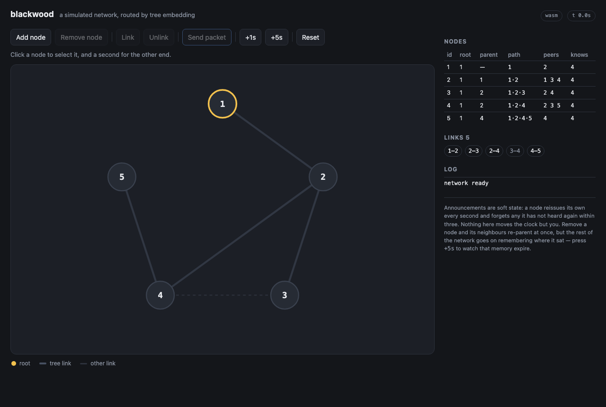

# blackwood

A minimal reimplementation of the [ironwood](https://github.com/Arceliar/ironwood)
routing protocol's core, in dependency-free Rust.

Nodes address one another by public key rather than by location, and reach each
other across a network where no node is guaranteed a direct link to any other.
Routing works by embedding the network in a spanning tree and greedily
forwarding towards the destination in the metric that embedding induces.

**[Try the demo →](https://zbarnett.github.io/blackwood/)** — a whole network in
one page: add and remove nodes and links, move the clock forward, and watch a
packet find its way.

[](https://zbarnett.github.io/blackwood/)

## The core

The node holding the smallest key in a connected component becomes the root.
Every node announces the path of keys running from that root down to itself. An
announcement crosses one link and stops there: a node needs to know where its
own peers sit and nothing else, so nothing is relayed and nothing accumulates.
Announcements are only ever authored by the node they describe, so what a node
holds about each peer is a max register whose join is simply the greater of the
two — a repeat, or one that arrives out of order, can be dropped on sight.

The distance between two nodes is the walk up to their lowest common ancestor
and back down, each link counted at what it costs to cross. A node forwards a
packet to whichever peer stands strictly closer to the destination. Three
properties follow, each from a local rule:

- **Loop-free forwarding.** Distance strictly decreases at every hop and is
  bounded below by zero, so a packet cannot revisit a node.
- **Loop-free tree.** An announcement carries its whole path, and a node refuses
  to sit below a path that already runs through it. Staleness can cost a node
  its route, never its acyclicity.
- **Delivery on a settled tree.** A node's tree neighbour towards the
  destination is always closer by exactly what the link between them costs, so
  there is always a next hop.

Both decisions weigh what a link costs — latency, in ironwood; whatever the
caller measures, here. A node sits below the peer offering the cheapest walk to
the root rather than the shortest one, and among the peers that make strict
progress it hands a packet to whichever leaves the least left to pay. A cost is
never zero, which is what keeps the two properties above standing; a network
whose links all cost the same measures distance in hops. Nobody has to agree
about any of it: each end of a link prices its own end, and a node announces
what it measured along with where it sits.

The destination's path travels in the packet, since no node along the way holds
it. That is also what makes the first property exact rather than nearly so:
every node on the route measures its progress against the same target rather
than against its own copy of one.

## Finding a node

Addressing a node that is not a peer means finding where it sits first. Each
node keeps, per tree link, a Bloom filter of the keys reachable through it — a
fixed few bytes however much lies beyond — built by folding together what its
*other* tree links told it. Leaving out the link the summary is bound for is
the whole trick: it makes each one mean "what is on my side of this". It is
also why summaries cross tree links only, since folded around a cycle they
would carry every key back to where it came from until each claimed everything.

A search then walks the tree, handed on at each step only to the neighbours
whose summary admits the target might lie beyond them, and the node being
looked for answers by retracing the search's own trail. A summary never misses
a key it holds, so a search cannot overlook the branch its target is really on;
one that claims a key it does not hold costs a detour and nothing more. As a
summary fills it prunes less, and in the limit a search is a flood — which is
what this would be without any of it.

What a node holds is a fixed amount per link, its own position, and the
positions of the nodes it is currently talking to. Nothing scales with the size
of the network.

## Signing

Every hop of an announcement carries the signature of the node it names, over
that hop and over every hop above it exactly as they stand. A walk down the tree
is a chain of statements, each made by the node it is about: nobody can put a
node somewhere it has not put itself, and no part of one announcement can be
lifted into another. That is what makes the answer to a search worth having,
since answering one is the only time a node speaks about anybody but itself.

The core performs none of it. It says what has to be signed and what has to be
checked, and takes the algorithm as a type parameter — which is how it carries
no dependencies and still refuses to take a stranger's word for anything. There
is no default and nothing to opt out of: a node cannot be built without a
[`Signer`](routing-core/src/signature.rs), so whatever a network is running,
somebody chose it. [`ed25519/`](ed25519/) is that choice made with real keys,
and holds the one third-party dependency in this repository. The tests supply a
stand-in with the cryptography left out, which the core cannot tell apart from
the real thing — that being the point — and which is compiled only for them.

Announcements are soft state. A node reissues its own on a schedule and forgets
any it has not heard reissued, so a view repairs itself rather than only
accumulating: a node that vanishes is eventually forgotten instead of lingering
as a route to nowhere, and one that comes back with its sequence numbers reset
is not mistaken for a stale copy of itself.

Nothing in the core performs I/O, reads a clock, allocates a thread, or calls
into the operating system. It has no dependencies beyond `std`, no `unsafe`, and
no panics: a node is a state machine whose every effect is the messages it hands
back and whose every input — a message, a link coming or going, the passage of
time — is an argument to a method. Even expiry reads no clock; `Node::tick` is
handed the current instant by its caller, in whatever unit that caller counts
in, and the schedule state is kept on comes from the caller too, for the same
reason the signing algorithm does: a number the core picked would be a number in
a unit it has no way of knowing. That is what makes a network of them
deterministically simulatable, and what should make the argument above tractable
to check in a proof assistant.

Two things ironwood does are left out, both hardening rather than part of the
model: a parent does not sign for its children, so a node can claim to sit below
a peer that never agreed to it, and summaries and searches are unsigned because
there is nobody but their sender who could sign them.
[`routing-core/src/lib.rs`](routing-core/src/lib.rs) records what each would
cost to close.

## Layout

| Path | What it is |
| --- | --- |
| [`routing-core/`](routing-core/) | The routing core. No dependencies, no I/O, no `unsafe` |
| [`ed25519/`](ed25519/) | ed25519 injected into the core's signing trait, and the only third-party dependency here |
| [`routing-core/tests/simulation.rs`](routing-core/tests/simulation.rs) | Brings a network up and carries a packet across it |
| [`viewer/`](viewer/) | The visualiser: a simulator, a small server, and a Svelte page |
| [`viewer/wasm/`](viewer/wasm/) | The same simulator compiled to WebAssembly, for the hosted demo |

## Running it

```sh
cargo test --workspace          # the core, its simulation, and the ed25519 network

cd viewer/ui && npm install && npm run build
cargo run -p blackwood-viewer   # then open http://127.0.0.1:8080
```

The demo above is the same page with the simulator compiled to WebAssembly
instead of served, so it needs nothing running behind it. To build that locally:

```sh
rustup target add wasm32-unknown-unknown
cd viewer/ui && npm run build:static
```

See [`viewer/README.md`](viewer/README.md) for the controls.
